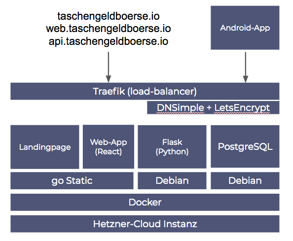

# Taschengeldbörse Webapp and Backend

## Software-Architecture



## Landingpage


## Web-App


# What we did to make this work?

### Docker Setup

- Initialize the remote Machine with `docker-machine`

```bash
docker-machine create \
    --driver generic \
    --generic-ip-address=<IP_OF_YOUR_MACHINE> \
    --generic-ssh-key ~/.ssh/<SSH_KEY_OF_YOUR_CHOICE> \
    <NAME_OF_YOUR_CHOICE>
```

- then `eval $(docker-machine <NAME_OF_YOUR_CHOICE>)`
- Your local Docker-Client is now connected to the Remote Machine 😱
- Adjust `infra/traefik.toml` for Traefik (they should be persisted)

```bash
docker-machine ssh <SSH_KEY_OF_YOUR_CHOICE> mkdir -p /opt/traefik
docker-machine scp -r ./infra/traefik.toml <SSH_KEY_OF_YOUR_CHOICE>:/opt/traefik/traefik.toml
docker-machine ssh <SSH_KEY_OF_YOUR_CHOICE> touch /opt/traefik/acme.json && chmod 600 /opt/traefik/acme.json
```

- You can now set the following environment variables

```
export COMPOSE_FILE="docker-compose.production.yml"

# We're doing a dns-challange for the wildcard certificate,
# so in this setup we're bound to the domain being on DNSimple

export DNSIMPLE_BASE_URL="https://api.dnsimple.com"
export DNSIMPLE_OAUTH_TOKEN="<YOUR_AUTH_TOKEN>"
```

- You're now ready to deploy with `docker-compose up -d --build`

### Development Workflow

##### Landingpage

- `cd landing`
- `python -m SimpleHTTPServer`

##### Web-App (React)

- `cd react`
- `npm install` (Node-Package-Manager should be installed)
- `npm start` (starts Create-React-App Scripts)
- `npm run build` builds for production - should be done before deployment


## Backend

> "Snape knew more curses when he arrived at Hogwarts than half the kids in seventh year."

`severus` is Taschengeldbörse's backend based on the awesome Python [Flask](http://flask.pocoo.org/) and [Flask-Potion](https://potion.readthedocs.io/) frameworks. It provides a RESTful JSON API to read or modify Taschengeldbörse entities (tasks, users, bids, etc.).

### Quickstart

Taschengeldbörse comes with a pre-configured `docker-compose.yml`. Just run `docker-compose up` to start a Postgres database and the API webserver. The API will be available at `http://localhost:5000/`.

If you want to bring your own database you can alternatively just install all Python dependencies via `pip install -r requirements.txt`, set the `DATABASE_URL` environment variable and run `python -m severus`.

### API reference

Severus supplies four main API endpoints: `/tasks`, `/users`, `/bids`, and `/categories`. Following the REST paradigm, each of these supports the HTTP `GET`, `POST`, `PATCH`, and `DELETE` methods. `POST` requests should supply a `Content-Type: application/json` header and use a JSON-encoded body.

#### Most common requests

##### Tasks

Retrieve the list of tasks, newest first:
```javascript
$ curl 'http://localhost:5000/tasks?sort=\{"id":true\}'
[
    {
        "$uri": "/tasks/145",
        "bids": [],
        "category": 3,
        "description": "Entfernung von Unkraut und sonstiger leichter Gartenarbeit. Der Einsatz von Maschinen ist nicht n\u00f6tig. Leichte Arbeitshandschuhe w\u00e4ren vorteilhaft, k\u00f6nnte ich auch besorgen, wenn die Gr\u00f6\u00dfe der H\u00e4nde bekannt sind",
        "distance_in_meters": 4156,
        "due_date": "2018-12-05",
        "estimated_time_in_minutes": 60,
        "id": 145,
        "status": 0,
        "title": "Entfernung von Unkraut und sonstiger leichter Gartenarbeit",
        "user": 5
    },
    ...
]
```

You can supply `lat` and `lon` parameters, either as query arguments or as HTTP headers, to set the base for calculating distances.

Add a new task:
```bash
$ curl -X POST http://localhost:5000/tasks -H "Content-Type: application/json" -d '{"user": 1, "title": "Tisch aufräumen", "due_date": "2018-10-06", "status": 0, "estimated_time_in_minutes": 5, "category": 1}'
```

##### Bids

Users can evince interest in performing a task by placing a bid for that task:

```bash
$ curl -X POST http://localhost:5000/bids -H "Content-Type: application/json" -d '{"user": 1, "task": 1}'
```

##### Users

Get list of users:
```javascript
$ curl http://localhost:5000/users             
[                                                               
    {
        "$uri": "/users/1",
        "address": "Albersloher Weg 133, 48155 M\u00fcnster",
        "bids": [],
        "birthday": null,
        "email": null,
        "id": 1,
        "is_admin": false,
        "name": "Meier, Emmi",
        "phone_number": null,
        "sex": null
    },
    ...
]
```

Get details for a single user:
```javascript
$ curl http://localhost:5000/users/1
{
    "$uri": "/users/1",
    "address": "Albersloher Weg 133, 48155 M\u00fcnster",
    "bids": [],
    "birthday": null,
    "email": null,
    "id": 1,
    "is_admin": false,
    "name": "Meier, Emmi",
    "phone_number": null,
    "sex": null
}
```

Create a new user:
```bash
$ curl -X POST http://localhost:5000/users -H "Content-Type: application/json" -d '{"name":"Harry Potter","address":"4 Privet Drive, Little Whinging, Surrey"}'
```

##### Categories

List categories:
```javascript
$ curl http://localhost:5000/categories       
[                                                                                               
    {
        "$uri": "/categories/1",
        "id": 1,
        "name": "Begleithilfe"
    },
    {
        "$uri": "/categories/2",
        "id": 2,
        "name": "Einkaufen / Boteng\u00e4nge"
    },
    ...
]
```

Add a new category:
```curl
$ curl -X POST http://localhost:5000/categories -H "Content-Type: application/json" -d '{"name": "Potion brewing"}'
```

#### Self-documentation
 Each of the four endpoints has an extensive auto-generated Hyper-Schema documentation available at `/schema`, e.g.:

```javascript
$ curl http://localhost:5000/categories/schema
{                                                                                                     
    "$schema": "http://json-schema.org/draft-04/hyper-schema#",
    "links": [
        {
            "href": "/categories",
            "method": "POST",
            "rel": "create",
            "schema": {
                "additionalProperties": false,
                "properties": {
                    "name": {
                        "type": "string"
                    }
                },
                "type": "object"
            },
            "targetSchema": {
                "$ref": "#"
            }
        },
        {
            "href": "/categories/schema",
            "method": "GET",
            "rel": "describedBy"
        },
        {
            "href": "/categories/{id}",
            "method": "DELETE",
            "rel": "destroy"
        },
        {
            "href": "/categories",
            "method": "GET",
            "rel": "instances",
       ...
```
