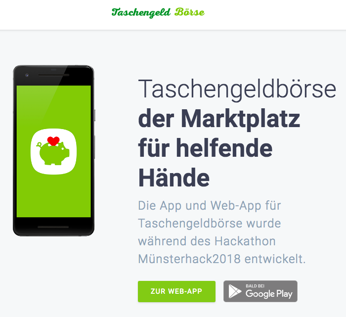

# Taschengeldbörse Webapp and Backend

## Software-Architecture


## Landingpage



## Android-App


## Web-App


# What we did to make this work?

### Docker Setup

- Initialize the remote Machine with `docker-machine`

```bash
docker-machine create \
    --driver generic \
    --generic-ip-address=<IP_OF_YOUR_MACHINE> \
    --generic-ssh-key ~/.ssh/<SSH_KEY_OF_YOUR_CHOICE> \
    <NAME_OF_YOUR_CHOICE>
```

- then `eval $(docker-machine <NAME_OF_YOUR_CHOICE>)`
- Your local Docker-Client is now connected to the Remote Machine 😱
- Adjust `infra/traefik.toml` for Traefik (they should be persisted)

```bash
docker-machine ssh <SSH_KEY_OF_YOUR_CHOICE> mkdir -p /opt/traefik
docker-machine scp -r ./infra/traefik.toml <SSH_KEY_OF_YOUR_CHOICE>:/opt/traefik/traefik.toml
docker-machine ssh <SSH_KEY_OF_YOUR_CHOICE> touch /opt/traefik/acme.json && chmod 600 /opt/traefik/acme.json
```

- You can now set the following environment variables

```
export COMPOSE_FILE="docker-compose.production.yml"

# We're doing a dns-challange for the wildcard certificate,
# so in this setup we're bound to the domain being on DNSimple

export DNSIMPLE_BASE_URL="https://api.dnsimple.com"
export DNSIMPLE_OAUTH_TOKEN="<YOUR_AUTH_TOKEN>"
```

- You're now ready to deploy with `docker-compose up -d --build`

### Development Workflow

##### Landingpage

- `cd landing`
- `python -m SimpleHTTPServer`

##### Web-App (React)

- `cd react`
- `npm install` (Node-Package-Manager should be installed)
- `npm start` (starts Create-React-App Scripts)
- `npm run build` builds for production - should be done before deployment
